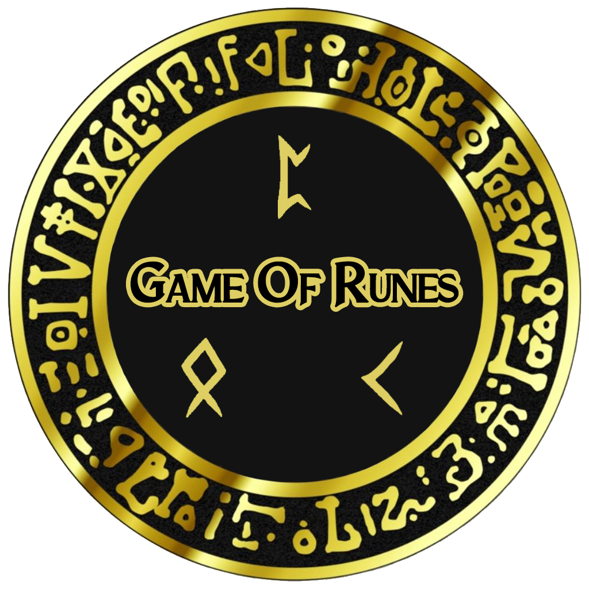
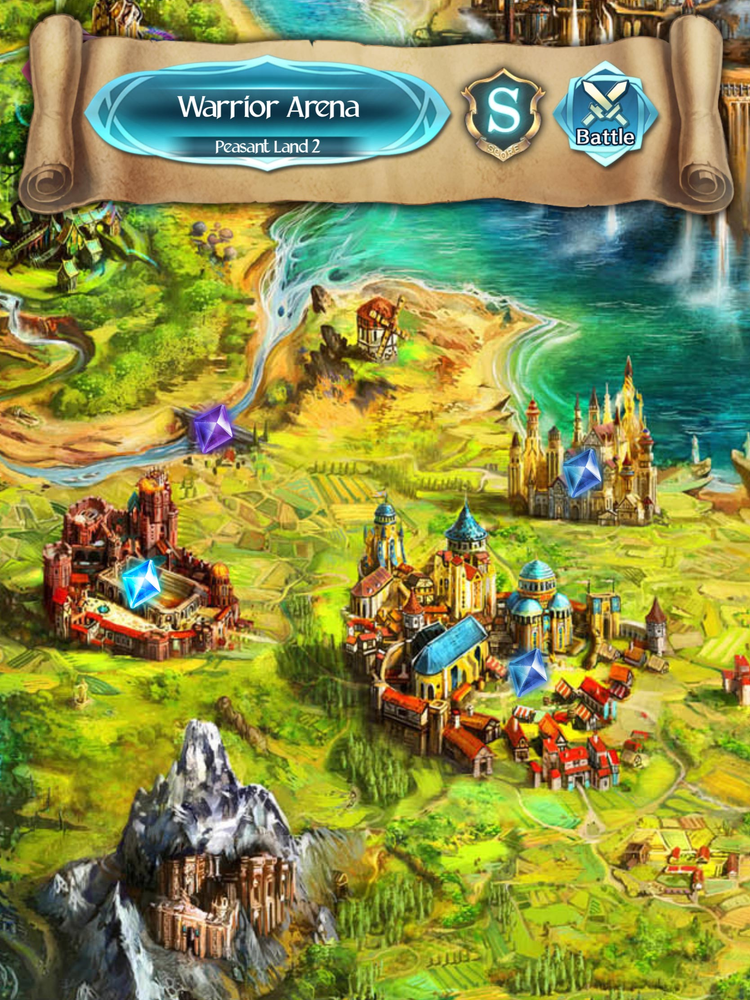
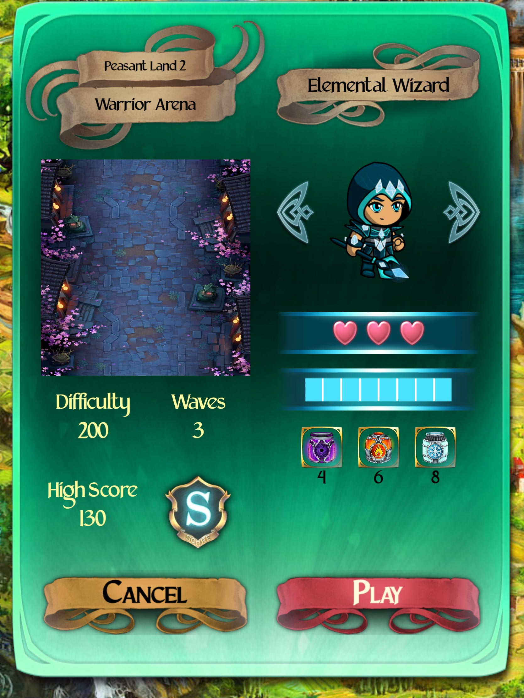
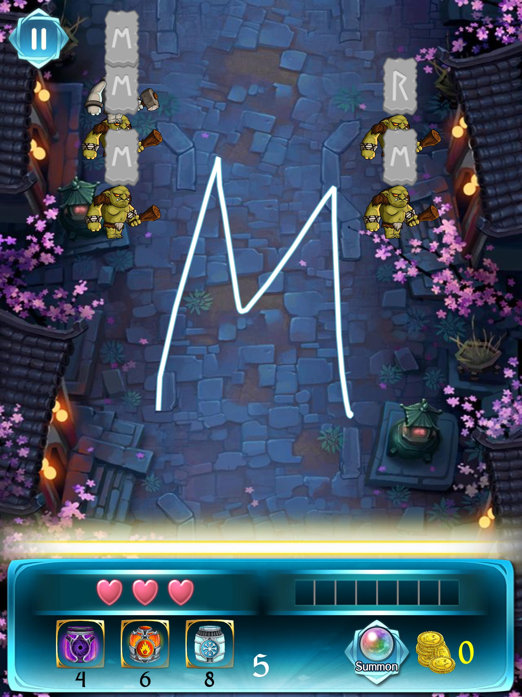

## Game Concept

Game Of Runes is a gesture-based iPad game where the player attempts to destroy incoming enemies through swiping gestures.
The game itself takes on a medieval theme, and the player will have to defend his/her castle from invading enemies. At the start of each stage, the player can select an avatar. Each avatar has a set of power ups associated with it - these power ups can then be activated in the stage to aid the player in clearing the stage.

## Previews and Player Guide

| Game Map | Avatar Selection | Gameplay |
|----------|------------------|----------|
| |  |  |

Player guide: [file](./Game%20Of%20Runes%20Player%20Guide.pdf)

Game demo: [video link](https://youtu.be/8g098szZv7U)

## Team

| Name | Username | Role |
|------|----------|------|
| Andy Lam Kwok Wee | [@andyylam](https://github.com/andyylam) | Full Stack & Network |
| Dong SiJi | [@dongsiji](https://github.com/dongsiji) | Backend & DevOps |
| Tan Kai Qun, Jeremy | [@JermyTan](https://github.com/JermyTan) | Frontend & UI/UX Design |
| Yen Ren Zuo Brian | [@brianyenna](https://github.com/brianyenna) | Backend & Algorithms |

